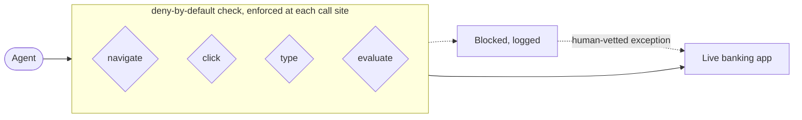

<picture>
  <source media="(prefers-color-scheme: dark)" srcset="https://raw.githubusercontent.com/szwedeks/szwedeks/main/assets/banner-dark.png">
  
</picture>

> [!NOTE]
> **Open to product leadership roles that are AI-related, or that I can make AI-related.** Location fully open.
> [m.r.szwed@gmail.com](mailto:m.r.szwed@gmail.com) · [LinkedIn](https://linkedin.com/in/maciek-szwed)

I ran product and design organisations for fifteen years. Most of that was at a Kraków consultancy, where I built the design discipline to thirty people and started the product function from nothing. Most recently I was the entire product function at a payments company in the Philippines: discovery, design, delivery, and the AI systems underneath it.

The part that changed in the last two years is that **I stopped specifying AI systems for other people to build and started building them.** It means I can prove or kill a bet in days instead of arguing about it for a quarter.

## Currently

- 🔍 Looking for my next product leadership role, anywhere
- 🤖 Building agents, eval harnesses and classification pipelines, mostly with Claude Code
- 📐 Preoccupied with measurement integrity: whether the number in front of you could ever have said something else
- ✍️ Writing up five systems I designed and shipped, as proper case studies
- 🌍 Kraków, and willing to move for the right role

## What I actually build

The clearest example I can show in full. I needed an agent to operate a **live banking application** to produce customer-facing documentation. The interesting part is not what it did. It is the four separate places where it was forbidden to.

**Deny by default, enforced at every entry path rather than at one.** A single chokepoint is a single thing to forget, and the failure mode here is an agent moving somebody's money. Exceptions are vetted by a human, never by the model. Two complete builds, zero external state changes.

## Systems I designed and shipped

Most of my work lives inside companies, so it gets written up rather than open-sourced.

**🔌 An MCP server over live production data**
Read-only access to our payments and analytics databases as permission-scoped tools, authorised per Google Workspace group, with every statement additionally wrapped in a `READ ONLY` transaction. Live schema introspection documents the known query traps so callers cannot time the database out. Support answers "where is this payment" without an engineer; product gets contribution margin by method and by merchant.

**🎫 Support tickets as a product signal**
Every ticket classified and clustered into persistent issues, scored on recurrence *and* on how many distinct clients each one hits, so a single noisy merchant stays separable from a real product defect. It named our largest ticket category precisely enough to kill it with a product change.

**📄 Releases that write their own customer documentation**
An LLM pipeline generating customer-facing release comms in production, behind a human review gate. The gate caught a false statement on its way to a bank's help centre. The gate, not the generation, is the product decision worth talking about.

**📡 off-script** · a solo AI product, zero to live in about twelve days
137 sources, n8n orchestration, local model enrichment, adapters, dedupe, scoring, a Telegram bot and an operator dashboard. I rebuilt the dashboard after admitting the first one was unreadable.

**🧪 rubric-evals** · an eval harness for a scorer that had stopped saying yes
An overnight pipeline scored 21 startup ideas and returned essentially zero passes. The obvious conclusion was that every idea was bad. The question I asked instead was whether the rubric could say yes to anything at all. It could not, and the rubric became the thing under test.

## Track record

| | |
|---|---|
| **15 years** | product, design and innovation leadership |
| **30+ people** | design organisation built and led, to full billability |
| **2** | product functions started from zero |
| **5** | AI systems specced, built and shipped |

## How I work

**Measure the instrument first.** Before trusting a number, find out whether the thing producing it could ever produce a different one. Five times now, in unrelated systems, that question has been the whole finding.

**Build it to find out.** A rough working version answers in days what a specification argues about for a quarter, and it surfaces the thing nobody thought to specify.

**Deny by default where it matters.** When an agent can touch money, safety is a product decision about what is forbidden and who is accountable, not an engineering detail added later.

**Say what went wrong.** Everything I write up ends on something unresolved or something I got wrong. A record of clean victories tells you nothing about how somebody thinks.

## Working with

## Elsewhere

<!-- Add once maciekszwed.com is live, and make it the primary link:

-->
